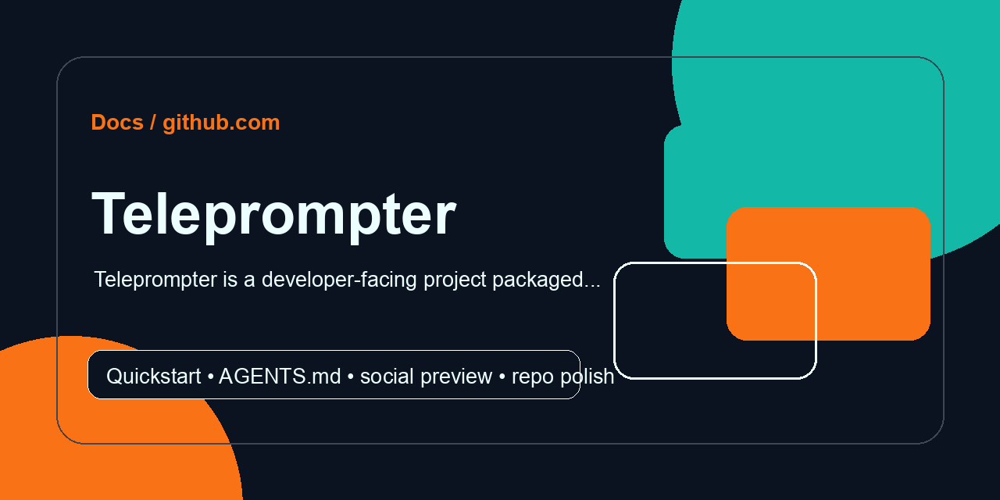

<!-- REPO-POLISH:START -->
<p align="center">
  
</p>

> Teleprompter is a developer-facing project packaged for quick local understanding.

## Quick Start

```bash
git clone https://github.com/Supersynergy/teleprompter
cd teleprompter
git status --short
```

Expected result: the project runs locally or reports the next missing prerequisite directly in the terminal.

## Developer Map

| Need | Command |
|---|---|
| inspect | `git status --short` |

Full verification path: `git status --short`

Agent instructions live in [AGENTS.md](AGENTS.md).
<!-- REPO-POLISH:END -->

# Teleprompter

